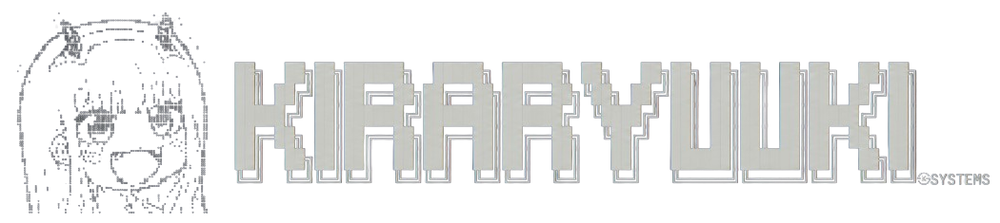

<!--

  
██╗  ██╗██╗██████╗  █████╗ ██████╗ ██╗   ██╗██╗ ██╗██╗ ██╗██╗  ██╗██╗

  
██║ ██╔╝██║██╔══██╗██╔══██╗██╔══██╗╚██╗ ██╔╝██║ ██║██║ ██║██║ ██╔╝██║

  
█████╔╝ ██║██████╔╝███████║██████╔╝ ╚████╔╝ ██║ ██║██║ ██║█████╔╝ ██║

  
██╔═██╗ ██║██╔══██╗██╔══██║██╔══██╗  ╚██╔╝  ██║ ██║██║ ██║██╔═██╗ ██║

  
██║  ██╗██║██║  ██║██║  ██║██║  ██║   ██║   ██████║██████║██║  ██╗██║

  
╚═╝  ╚═╝╚═╝╚═╝  ╚═╝╚═╝  ╚═╝╚═╝  ╚═╝   ╚═╝   ╚═════╝╚═════╝╚═╝  ╚═╝╚═╝

-->

## Hi there, I'm Muhammad Ilham 👋!

### Full-Stack Developer · DevOps · Application & Network Security

I enjoy exploring how systems work, experimenting with ideas, and turning what I learn into practical projects. My interests span application development, infrastructure, and security.

  <picture>
    
  </picture>

### Areas of Interest

- **Full-Stack Development** · building and improving web applications.
- **DevOps & Infrastructure** · Linux, containerization, Kubernetes, and deployment workflows.
- **Application & Network Security** · exploring defensive techniques and security testing.

### Connect

- 📫 **Email:** [m.ilham.v.28.07.2003@gmail.com](mailto:m.ilham.v.28.07.2003@gmail.com)
- 💼 **LinkedIn:** [linkedin.com/in/kiraryuuki](https://linkedin.com/in/kiraryuuki)
- 🌐 **Portfolio:** [kiraryuuki.github.io/KiRaRyuuKi](https://kiraryuuki.github.io/KiRaRyuuKi)

  <picture>
    <source
    media="(prefers-color-scheme: dark)"
    srcset="https://github.com/KiRaRyuuKi/KiRaRyuuKi/blob/output/github-contribution-grid-snake-dark.svg?raw=true">
  <source
    media="(prefers-color-scheme: light)"
    srcset="https://github.com/KiRaRyuuKi/KiRaRyuuKi/blob/output/github-contribution-grid-snake.svg?raw=true">
    
  </picture>

